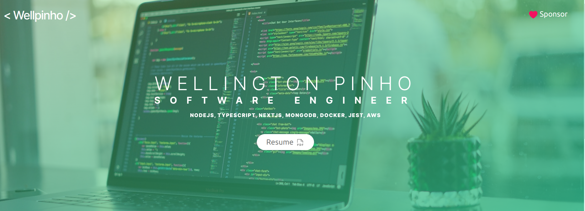

<h1 align="center">Portfólio Wellingotn Pinho</h1>
<p align="center">My portfolio with NextJs, Nodejs and MongoDB, Prisma.io and more...</p>

## header
<h2 align="center">
  
</h2>

## experience
<h2 align="center">
  
</h2>

## skills
<h2 align="center">
  
</h2>

## work experiences
<h2 align="center">
  
</h2>

## More recent projects
<h2 align="center">
  
</h2>

## Linkedin recommendations
<h2 align="center">
  
</h2>

## Contact form
<h2 align="center">
  
</h2>

## Steps:
1. Clone this repository: ``` https://github.com/wellpinho/portfolio-nextjs.git ```
2. ``` cd portfolio-nextjs ```
3. ``` cd backend && yarn && yarn prisma generate ``` after instalation run ``` yarn dev ``` backend run on port 4000
4. ``` cd frontend && yarn ``` after instalation run ``` yarn dev ``` access on http://localhost:3000

configurations on frontend:
1. header component needs to edit data in folder objects for contact and links: src/objects/index.ts
